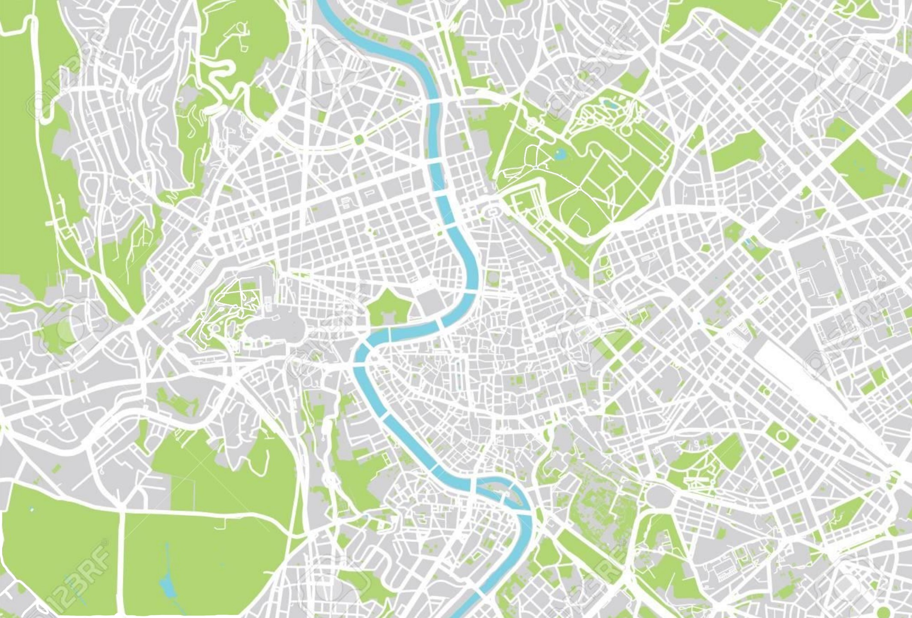

# Map of Rome Path Finder
The Map of Rome Path Finder is a Java based desktop application that allows the user to import an  
image of a city in a bird's eye view perspective, and the program allows the user to create paths on  
the map.  
 
An example of a map that is compatible with this software is the following. 
  
 
<h2> Settings </h2>
